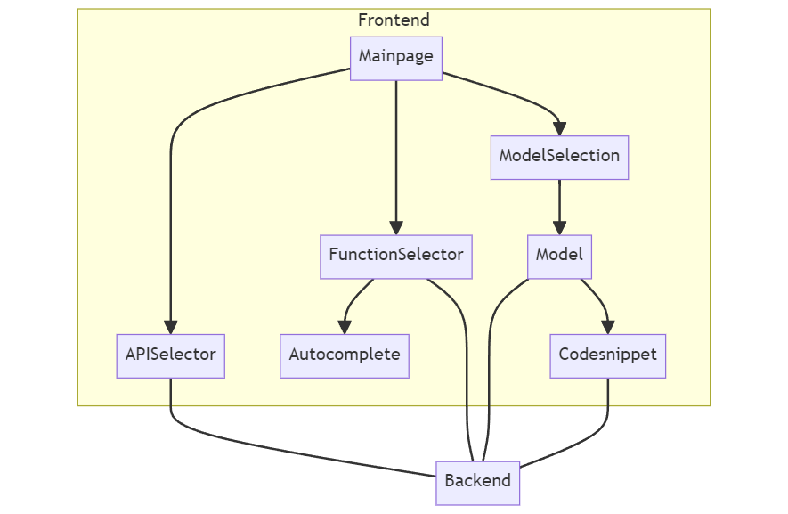
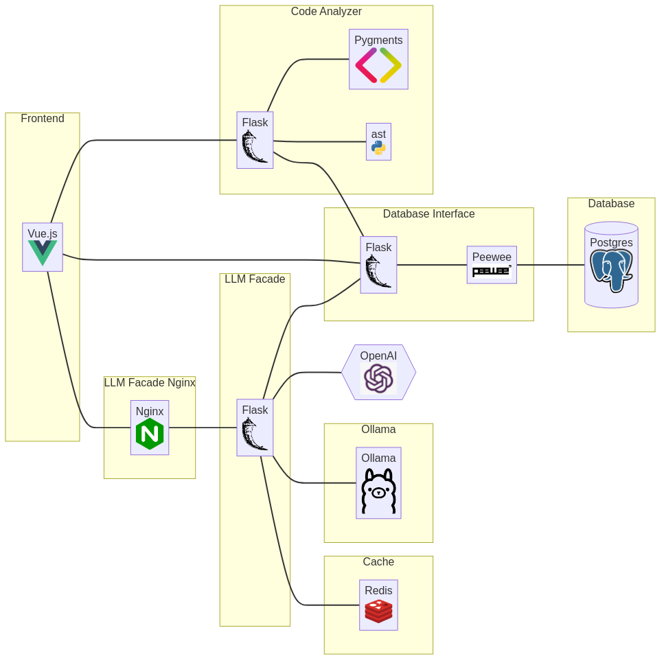
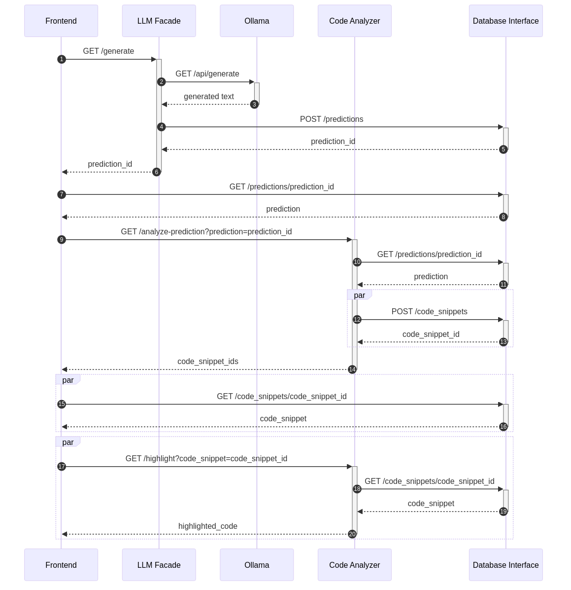

[](https://github.com/CR1337/xLLaMa/blob/master/LICENSE)

# xLLaMa

## Abstract
When working with an unfamiliar API or framework, the absence of meaningful code examples within the documentation can pose a significant challenge. Turning to AI and chatbots for assistance in this situation, quickly becomes repetitive and inefficient, particularly when dealing with lesser-known APIs requiring additional documentation for each function.

To address this dilemma, we present xLLaMa, a user-friendly web interface designed to streamline the generation of code examples across multiple APIs. xLLaMa simplifies the process by eliminating the need for manual prompts to an LLM. Instead, users can simply select an API and their corresponding functions from a dropdown menu before an example is generated by multiple LLMs simultaneously.
If the generated example includes other functions from the API, users can easily select them within the code snippet to generate additional examples. Moreover, users can request explanations of the code or more detailed variations of the example with the click of a button. Additional features include direct links to API documentation for each function and a history of previously generated examples.

Users have responded positively to the tool, noting its potential to improve their workflow when working with a new API. They also appreciate the convenience of having all frameworks and features collected in one easily accessible platform.

Further information can be found [here](doc/xLLaMa_endpresentation.pdf).

## How to use
Setup instructions can be found [here](https://github.com/CR1337/xLLaMa?tab=readme-ov-file#setup).

The web interface of xLLaMa is intuitively structured to match a user's workflow by going from the top to the bottom.
In order to generate an example, users first select their preferred API or framework.
From there they can choose a function, either by selecting one of the suggested functions or by picking it from the dropdown menu.
Once a function has been selected, users can generate their example right away. The generation process takes place simultaneously with multiple LLMs, offering a broader range of choices.

If users encounter any difficulties understanding the code, they can have it explained to them or open the API documentation for further technical details.
Within the example code, various other functions are highlighted and can be selected in order to generate further examples.

Users can request a longer or shorter version of the code example by pressing one of the buttons below.
The generated code can also be copied to the clipboard by pressing the button located in the top left-hand corner.
Once users have finished with a particular code snippet, they can close this example and proceed with their work.

A demonstration video can be found [here](https://github.com/CR1337/xLLaMa/blob/main/doc/xLLaMa_demonstration_video.mp4).


## Repository Structure


## Architecture
### Component Diagrams
#### Frontend


#### Backend



### Sequence Diagrams

The following sequnce diagram shows what happens during an example generation.




## Setup

### Installation

#### 1. Install Docker
See [Docker Installation](https://docs.docker.com/engine/install/) (if not already installed)

#### 2. Install Python 3
Install at least Python 3.10 with Pip (if not already installed). Earlier versions might work but are not tested.

#### 3. Clone this Repository
```bash
git clone https://github.com/CR1337/xLLaMa.git
```

#### 4. Change into the Repository
```bash
cd xLLaMa
```

#### 5. Create a virtual environment (optional)
```bash
python3 -m venv .venv
```

#### 6. Activate the virtual environment (optional)
```bash
source .venv/bin/activate
```

#### 7. Run setup script
If you are on the production server with GPUs 2 and 3, run
```bash
bin/setup
```
else run
```bash
bin/setup-local
```

### Usage
#### 1. Run the application
For running in the background (recommended for production):
```bash
bin/run
```
For seeing terminal output (recommended for development):
```bash
bin/run-blocking
```

If you are not on the production server with GPUs 2 and 3 use
```bash
bin/run-local
```
or
```bash
bin/run-blocking-local
```
respectively.

#### 2. Open the application
Open the application in a browser at http://localhost:8080. You can replace localhost with the IP of the server.

#### 3. Stop the application
```bash
bin/stop
```
or if you are not on the production server with GPUs 2 and 3
```bash
bin/stop-local
```


## Dependencies

### Python Pip
- requests 2.31.0
- tqdm 4.66.0
- flask 3.0.0
- flask-cors 4.0.0
- gunicorn 21.2.0
- openai 1.3.4
- redis 5.0.1
- peewee 3.17.0
- pygments 2.17.2

### Node
- vue 3.3.4
- primevue 3.44.0
- vue-markdown-renderer 2.1.1
- vue-router 4.2.5
- vue-toast-notification 3.1.2

### Other
- docker
- docker-compose


## Hardware Requirements
- Linux with 2 GPUS with ~32 GB VRAM each
