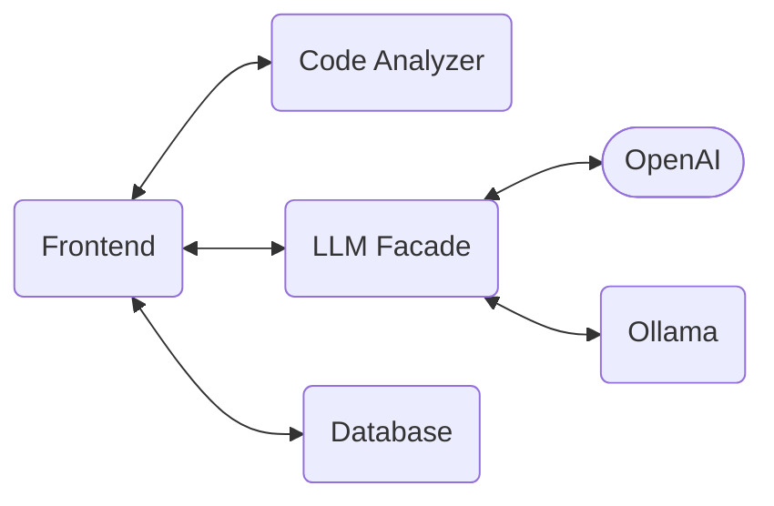
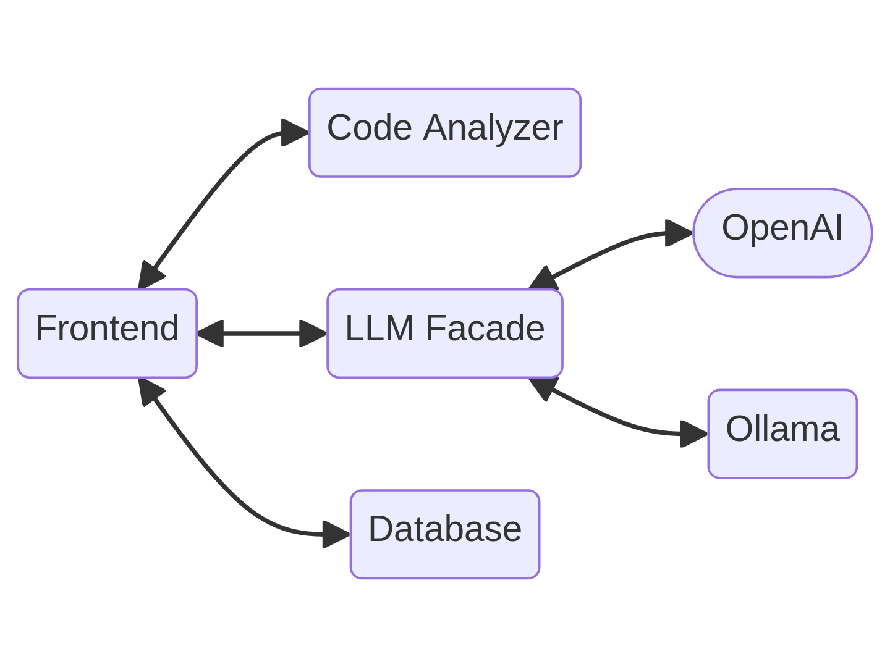

## Laras Teil

Letztes Mal haben wir euch von Luisa erzählt, einer Softwareentwicklerin, die sich ein Tool zur Generierung von Codebeispielen wünscht, mit dem sie schneller und einfacher relevante Beispiele vorgeschlagen bekommt, ohne zunächst längere Unterhaltungen mit dem LLM führen zu müssen.

Wir haben das Tool in Form einer Webanwendung entwickelt, um eine längerfristige und bessere Kompatibilität zu gewährleisten.

Zur Zeit können nur Beispiele für pandas generiert werden, allerdings lässt sich die Anwendung mit der Zeit für beliebig viele weitere Frameworks und APIs erweitern.
Man wählt die gewünschte Funktion aus, für die ein Beispiel generiert werden soll, entweder frei oder aus einer Liste von Vorschlägen. Falls die Zeit ausreicht, würden wir diese Liste gern dynamischer generieren.
Um eine möglichst gute Auswahl von Beispielen zu ermöglichen und den Prozess weiter zu beschleunigen, wird das Beispiel von mehreren Modellen gleichzeitig generiert.

Als ein weiteres Feature soll es später möglich sein, sich nach der Generierung das Beispiel erklären lassen, oder eine erneute Generierung anhand von Feedback anzuregen. Es soll außerdem möglich sein, sich Funktionen direkt aus dem Beispiel auszuwählen und auch zu ihnen ein Beispiel zu generieren. Daran arbeiten wir derzeit noch, der Grundbaustein im Backend ist allerdings bereits gelegt.

Unser Ziel ist es, einen guten Kompromiss aus Geschwindigkeit und Qualität zu finden. Die Generierung soll möglichst schnell mit nur wenigen Klicks geschehen, die Qualität des Beispiels soll allerdings hoch genug sein, damit die Beispiele tatsächlich hilfreich sind. Wir können dies am besten an uns selbst testen, indem wir das Tool während unserer Arbeit benutzen.

Zu unseren größten Herausforderungen gehörte bislang die Verbindung von Frontend und Backend, da wir beide Teile zunächst separat implementiert haben. Außerdem haben wir das Frontend zunächst in Plain HTML und Javascript implementiert, was auf Dauer allerdings nicht gut funktioniert- und vieles zu kompliziert gemacht hat.
Nun haben wir es erneut auf Basis von Vue.js implementiert.

## Christians Teil

Das Backend besteht aus einer Menge von Docker Compose Services. Neben einer Datenbank, welche unter Anderem die generierten Beispiele, die LLMs und das Userfeedback verwaltet, gibt es auch noch den ollama-service, welcher die einfache lokale Installation von Modellen und die anschließende Textgeneirung mit diesen ermöglicht.

Um in Zukunft auch OpenAi-Modelle unterstützen zu können, gibt es die LLM Fassade, einen weiteren Service, der die Interfaces von ollama und OpenAI abstrahiert und eine einheitliche Schnittstelle zur Textgenerierung bereitstellt.

Die generierten Texte werden dem Code Analyzer Service übergeben. Dieser macht automatisch python Codesnippets in den Texten ausfindig und analysiert diese. Dabei wird der Code in einen abstrakten Syntaxbaum geparsed. Anschließend werden mit Hilfe eines Visitors Informationen wie definierte Variablen, Funktionnen und Klassen und importierte Objekte, sowie die Referenzen darauf extrahiert.

Eine große Herausforderung dabei war, dass in Python eine Zuweisung eine Deklaration sein kann aber nicht muss. Auch die komplexe Namensauflösung durch die Schlüsselwörter global und nonlocal hat die Implementierung erschwert.

Außerdem berechnet der Code Analyzer eine Reihe an Codemetriken, die in Zukunft für die Bewerrtung und das Ranking von generiertem Codfe verwendet werden können.

Eine Herausforderung, vor der wir aktuell stehen ist, dass die Codegenerierung lokal sehr langsam ist. Die Portierung auf den Server mit der stärkeren Hardware zieht noch einiges an Debugging-Arbeit nach sich (Stichwort: It works on my machine).

Ist das gelöst, soll unser nächster Schritt sein, im Frontend die Definitionen von und Referenzen auf Variablen, Funktionen und Klassen zu highlighten und Kontextaktionen bereitzustellen. So soll es möglich sein, sich bswp. ein Beispiel für die Verwendung einer Funktion anzeigen zu lassen, die im aktuellen generierten Codebeispiel vorkam.

