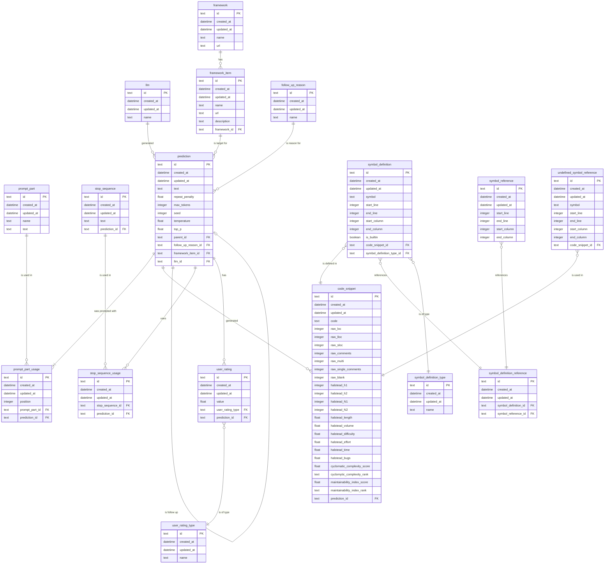

# Entity Relationship Diagram of Database

```mermaid
erDiagram
    framework {
        text id PK
        datetime created_at
        datetime updated_at
        text name
        text url
    }
    llm {
        text id PK
        datetime created_at
        datetime updated_at
        text name
    }
    framework_item {
        text id PK
        datetime created_at
        datetime updated_at
        text name
        text url
        text description
        text framework_id FK
    }
    prompt_part {
        text id PK
        datetime created_at
        datetime updated_at
        text name
        text text
    }
    prompt_part_usage {
        text id PK
        datetime created_at
        datetime updated_at
        integer position
        text prompt_part_id FK
        text prediction_id FK
    }
    follow_up_reason {
        text id PK
        datetime created_at
        datetime updated_at
        text name
    }
    stop_sequence {
        text id PK
        datetime created_at
        datetime updated_at
        text text
        text prediction_id FK
    }
    stop_sequence_usage {
        text id PK
        datetime created_at
        datetime updated_at
        text stop_sequence_id FK
        text prediction_id FK
    }
    prediction {
        text id PK
        datetime created_at
        datetime updated_at
        text text
        float repeat_penalty
        integer max_tokens
        integer seed
        float temperature
        float top_p
        text parent_id FK
        text follow_up_reason_id FK
        text framework_item_id FK
        text llm_id FK
    }
    code_snippet {
        text id PK
        datetime created_at
        datetime updated_at
        text code
        integer raw_loc
        integer raw_lloc
        integer raw_sloc
        integer raw_comments
        integer raw_multi
        integer raw_single_comments
        integer raw_blank
        integer halstead_h1
        integer halstead_h2
        integer halstead_N1
        integer halstead_N2
        float halstead_length
        float halstead_volume
        float halstead_difficulty
        float halstead_effort
        float halstead_time
        float halstead_bugs
        float cyclomatic_complexity_score
        text cyclomytic_complexity_rank
        float maintainability_index_score
        text maintainability_index_rank
        text prediction_id FK
    }
    symbol_definition_type {
        text id PK
        datetime created_at
        datetime updated_at
        text name
    }
    symbol_definition {
        text id PK
        datetime created_at
        datetime updated_at
        text symbol
        integer start_line
        integer end_line
        integer start_column
        integer end_column
        boolean is_builtin
        text code_snippet_id FK
        text symbol_definition_type_id FK
    }
    symbol_definition_reference {
        text id PK
        datetime created_at
        datetime updated_at
        text symbol_definition_id FK
        text symbol_reference_id FK
    }
    symbol_reference {
        text id PK
        datetime created_at
        datetime updated_at
        integer start_line
        integer end_line
        integer start_column
        integer end_column
    }
    undefined_symbol_reference {
        text id PK
        datetime created_at
        datetime updated_at
        text symbol
        integer start_line
        integer end_line
        integer start_column
        integer end_column
        text code_snippet_id FK
    }
    user_rating_type {
        text id PK
        datetime created_at
        datetime updated_at
        text name
    }
    user_rating {
        text id PK
        datetime created_at
        datetime updated_at
        float value
        text user_rating_type FK
        text prediction_id FK
    }

    framework ||--o{ framework_item : "has"
    prediction ||--|{ prompt_part_usage: "was prompted with"
    prompt_part ||--o{ prompt_part_usage: "is used in"
    prediction ||--o{ code_snippet: "generated"
    prediction ||--o| prediction: "is follow up"
    follow_up_reason ||--o{ prediction: "is reason for"
    framework_item ||--o{ prediction: "is target for"
    llm ||--o{ prediction: "generated"
    symbol_definition }o--|| code_snippet: "is defined in"
    undefined_symbol_reference }o--|| code_snippet: "is used in"
    symbol_reference }o--|| symbol_definition_reference: "references"
    symbol_definition }o--|| symbol_definition_reference: "references"
    prediction ||--o{ stop_sequence_usage: "uses"
    stop_sequence ||--o{ stop_sequence_usage: "is used in"
    user_rating }o--|| user_rating_type: "is of type"
    prediction ||--o{ user_rating: "has"
    symbol_definition }o--|| symbol_definition_type: "is of type"

```
