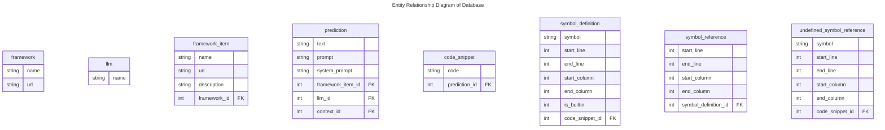

```mermaid
---
title: Entity Relationship Diagram of Database
---
erDiagram
    framework {
        string name
        string url
    }
    llm {
        string name
    }
    framework_item {
        string name
        string url
        string description
        int framework_id FK
    }
    prediction {
        string text
        string prompt
        string system_prompt
        int framework_item_id FK
        int llm_id FK
        int context_id FK
    }
    code_snippet {
        string code
        int prediction_id FK
    }
    symbol_definition {
        string symbol
        int start_line
        int end_line
        int start_column
        int end_column
        int is_builtin
        int code_snippet_id FK
    }
    symbol_reference {
        int start_line
        int end_line
        int start_column
        int end_column
        int symbol_definition_id FK
    }
    undefined_symbol_reference {
        string symbol
        int start_line
        int end_line
        int start_column
        int end_column
        int code_snippet_id FK
    }
```
