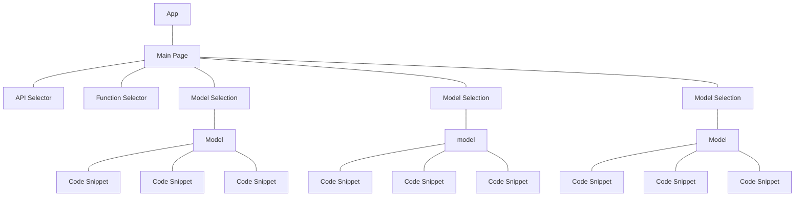
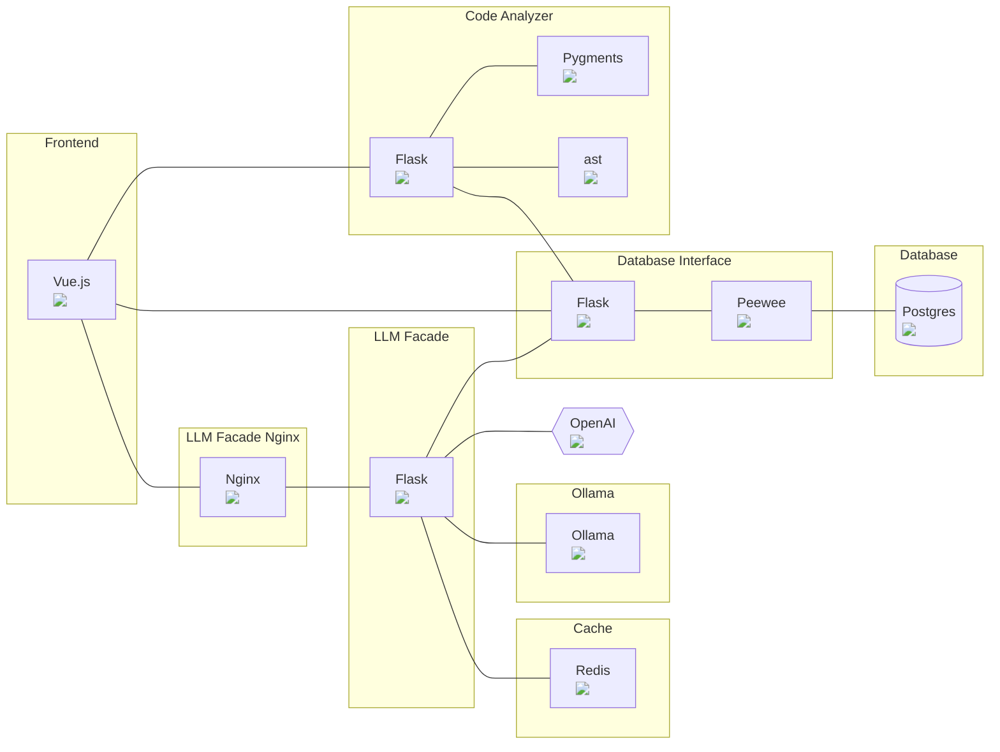
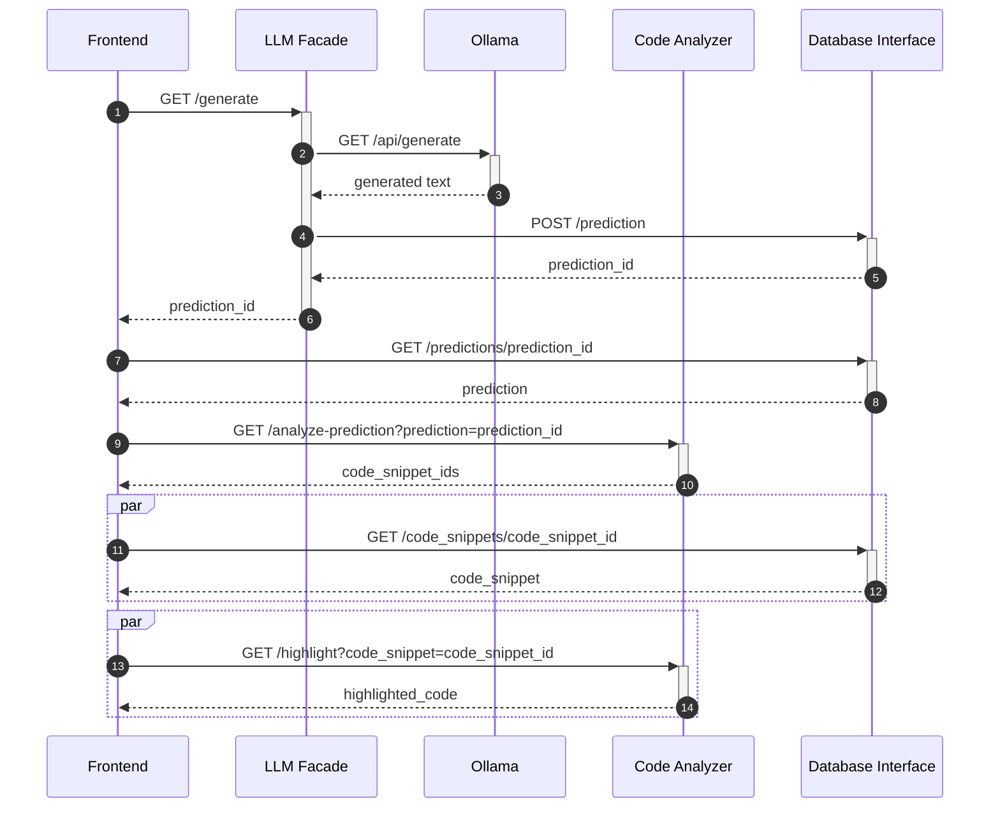
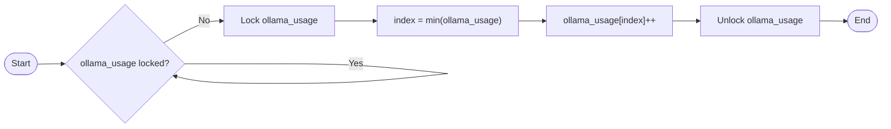
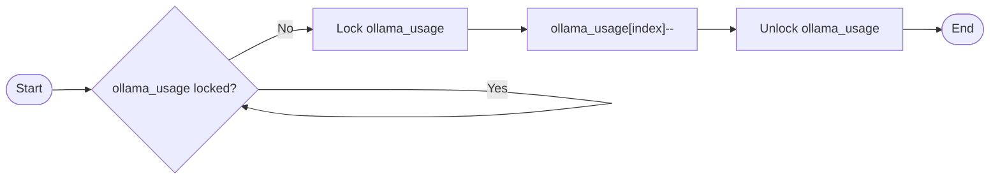

# Diagrams

## Frontend


```mermaid
flowchart TB
    app[App]
    main-page[Main Page]
    api-selector[API Selector]
    function-selector[Function Selector]
    model-selection-1[Model Selection]
    model-selection-2[Model Selection]
    model-selection-3[Model Selection]
    model-1[Model]
    model-2[model]
    model-3[Model]
    code-snippet-1-1[Code Snippet]
    code-snippet-1-2[Code Snippet]
    code-snippet-1-3[Code Snippet]
    code-snippet-2-1[Code Snippet]
    code-snippet-2-2[Code Snippet]
    code-snippet-2-3[Code Snippet]
    code-snippet-3-1[Code Snippet]
    code-snippet-3-2[Code Snippet]
    code-snippet-3-3[Code Snippet]

    app --- main-page
    main-page --- api-selector
    main-page --- function-selector
    main-page --- model-selection-1
    main-page --- model-selection-2
    main-page --- model-selection-3
    model-selection-1 --- model-1
    model-selection-2 --- model-2
    model-selection-3 --- model-3
    model-1 --- code-snippet-1-1
    model-1 --- code-snippet-1-2
    model-1 --- code-snippet-1-3
    model-2 --- code-snippet-2-1
    model-2 --- code-snippet-2-2
    model-2 --- code-snippet-2-3
    model-3 --- code-snippet-3-1
    model-3 --- code-snippet-3-2
    model-3 --- code-snippet-3-3
```

## Architecture


```mermaid
flowchart LR
    subgraph Frontend
        vue[Vue.js<img src="https://upload.wikimedia.org/wikipedia/commons/thumb/9/95/Vue.js_Logo_2.svg/1024px-Vue.js_Logo_2.svg.png">]
    end
    subgraph Database Interface
        flask-di[Flask<image src="https://flask-training-courses.uk/images/flask-logo.png">]
        peewee[Peewee<image src="https://docs.peewee-orm.com/en/latest/_images/peewee3-logo.png">]
    end
    subgraph Database
        postgres[(Postgres<image src="https://upload.wikimedia.org/wikipedia/commons/thumb/2/29/Postgresql_elephant.svg/1985px-Postgresql_elephant.svg.png">)]
    end
    subgraph code-analyzer[Code Analyzer]
        flask-ca[Flask<image src="https://flask-training-courses.uk/images/flask-logo.png">]
        pygments[Pygments<image src="https://external-content.duckduckgo.com/iu/?u=https%3A%2F%2Fit-gro.github.io%2Fhugo-theme-w3css-basic.github.io%2Fresources%2Fimages%2Fteaserpics%2Fbitbucket.org%2Fpygments-main-logo_hu83f454384722f2ac083918ae2d1f75df_15959_800x0_resize_box_3.png&f=1&nofb=1&ipt=872c769311d235d625b4f5f4ef04111f01e31537b130c4fc8e4f0f1709798ac7&ipo=images">]
        ast[ast<image src="https://logos-download.com/wp-content/uploads/2016/10/Python_logo_icon.png">]
    end
    subgraph llm-facade-nginx[LLM Facade Nginx]
        nginx[Nginx<image src="https://logodownload.org/wp-content/uploads/2018/03/nginx-logo-3.png">]
    end
    subgraph llm-facade[LLM Facade]
        flask-lf[Flask<image src="https://flask-training-courses.uk/images/flask-logo.png">]
    end
    subgraph Ollama
        ollama[Ollama<image src="https://ollama.ai/public/ollama.png">]
    end
    subgraph Cache
        redis[Redis<image src="https://res.cloudinary.com/practicaldev/image/fetch/s--gWwIv4vV--/c_limit%2Cf_auto%2Cfl_progressive%2Cq_auto%2Cw_880/https://thepracticaldev.s3.amazonaws.com/i/787xlgwc2hhq3ctzxcvs.png">]
    end
    openai{{OpenAI<image src="https://static.vecteezy.com/system/resources/previews/022/227/370/original/openai-chatgpt-logo-icon-free-png.png">}}

    flask-ca --- pygments
    flask-ca --- ast

    flask-di --- peewee

    vue --- flask-ca
    vue --- flask-di
    vue --- nginx
    nginx --- flask-lf

    peewee --- postgres

    flask-lf --- flask-di
    flask-lf --- openai
    flask-lf --- ollama
    flask-lf --- redis

    flask-ca --- flask-di

```

## Simple generation


```mermaid
sequenceDiagram
    autonumber

    participant FE as Frontend
    participant LF as LLM Facade
    participant OL as Ollama
    participant CA as Code Analyzer
    participant DI as Database Interface

    FE ->>+ LF: GET /generate
        LF ->>+ OL: GET /api/generate
        OL -->>- LF: generated text
        LF ->>+ DI: POST /prediction
        DI -->>- LF: prediction_id
    LF -->>- FE: prediction_id

    FE ->>+ DI: GET /predictions/prediction_id
    DI -->>- FE: prediction

    FE ->>+ CA: GET /analyze-prediction?prediction=prediction_id
    CA -->>- FE: code_snippet_ids

    par
        FE ->>+ DI: GET /code_snippets/code_snippet_id
        DI -->>- FE: code_snippet
    end

    par
        FE ->>+ CA: GET /highlight?code_snippet=code_snippet_id
        CA -->>- FE: highlighted_code
    end
```

## Parallel Generation

```python
ollama_usage = {
    "0": 0
    "1": 0
}
```


```mermaid
flowchart LR
    start(["Start"])
    _end(["End"])

    locked{"ollama_usage locked?"}
    lock["Lock ollama_usage"]
    min["index = min(ollama_usage)"]
    inc["ollama_usage[index]++"]
    unlock["Unlock ollama_usage"]

    start --> locked
    locked --> |Yes| locked
    locked --> |No| lock
    lock --> min
    min --> inc
    inc --> unlock
    unlock --> _end
```


```mermaid
flowchart LR
    start(["Start"])
    _end(["End"])

    locked{"ollama_usage locked?"}
    lock["Lock ollama_usage"]
    dec["ollama_usage[index]--"]
    unlock["Unlock ollama_usage"]

    start --> locked
    locked --> |Yes| locked
    locked --> |No| lock
    lock --> dec
    dec --> unlock
    unlock --> _end
```


