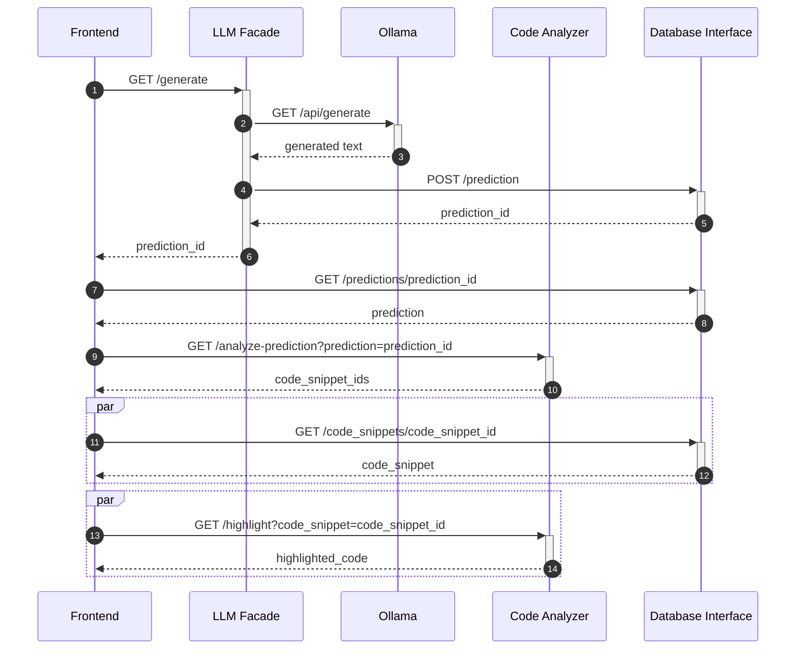

# Sequence Diagrams

## Simple generation

```mermaid
sequenceDiagram
    autonumber

    participant FE as Frontend
    participant LF as LLM Facade
    participant OL as Ollama
    participant CA as Code Analyzer
    participant DI as Database Interface

    FE ->>+ LF: GET /generate
        LF ->>+ OL: GET /api/generate
        OL -->>- LF: generated text
        LF ->>+ DI: POST /prediction
        DI -->>- LF: prediction_id
    LF -->>- FE: prediction_id

    FE ->>+ DI: GET /predictions/prediction_id
    DI -->>- FE: prediction

    FE ->>+ CA: GET /analyze-prediction?prediction=prediction_id
    CA -->>- FE: code_snippet_ids

    par
        FE ->>+ DI: GET /code_snippets/code_snippet_id
        DI -->>- FE: code_snippet
    end

    par
        FE ->>+ CA: GET /highlight?code_snippet=code_snippet_id
        CA -->>- FE: highlighted_code
    end
```
