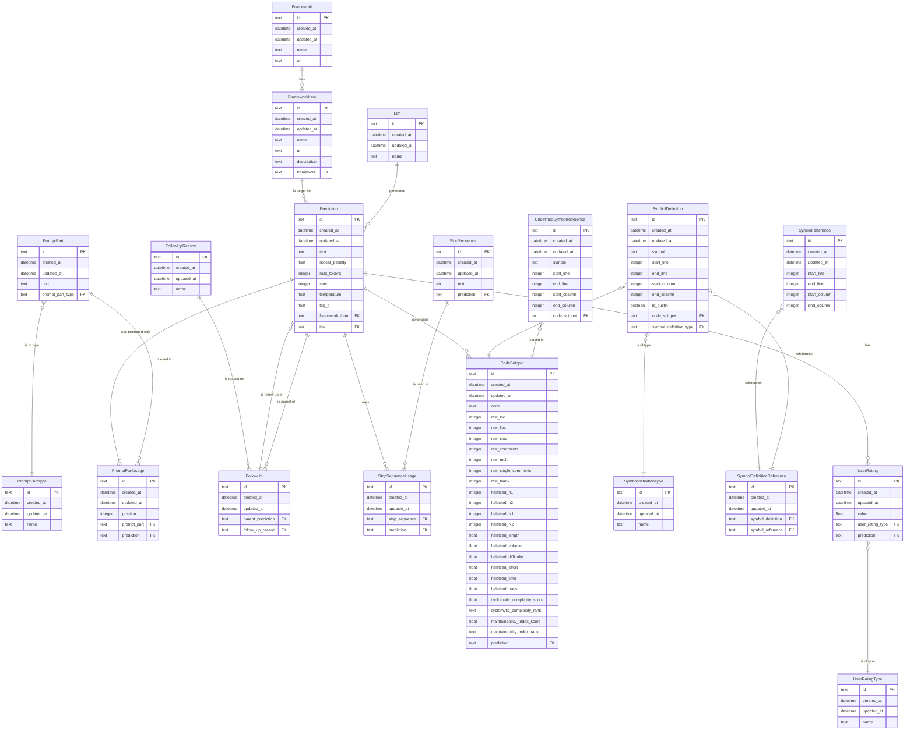

# Database Interface

## Entity Relationship Diagram of Database

```mermaid
erDiagram
    Framework {
        text id PK
        datetime created_at
        datetime updated_at
        text name
        text url
    }
    Llm {
        text id PK
        datetime created_at
        datetime updated_at
        text name
    }
    FrameworkItem {
        text id PK
        datetime created_at
        datetime updated_at
        text name
        text url
        text description
        text framework FK
    }
    PromptPart {
        text id PK
        datetime created_at
        datetime updated_at
        text text
        text prompt_part_type FK
    }
    PromptPartType {
        text id PK
        datetime created_at
        datetime updated_at
        text name
    }
    PromptPartUsage {
        text id PK
        datetime created_at
        datetime updated_at
        integer position
        text prompt_part FK
        text prediction FK
    }
    FollowUp {
        text id PK
        datetime created_at
        datetime updated_at
        text parent_prediction FK
        text follow_up_reason FK
    }
    FollowUpReason {
        text id PK
        datetime created_at
        datetime updated_at
        text name
    }
    StopSequence {
        text id PK
        datetime created_at
        datetime updated_at
        text text
        text prediction FK
    }
    StopSequenceUsage {
        text id PK
        datetime created_at
        datetime updated_at
        text stop_sequence FK
        text prediction FK
    }
    Prediction {
        text id PK
        datetime created_at
        datetime updated_at
        text text
        float repeat_penalty
        integer max_tokens
        integer seed
        float temperature
        float top_p
        text framework_item FK
        text llm FK
    }
    CodeSnippet {
        text id PK
        datetime created_at
        datetime updated_at
        text code
        integer raw_loc
        integer raw_lloc
        integer raw_sloc
        integer raw_comments
        integer raw_multi
        integer raw_single_comments
        integer raw_blank
        integer halstead_h1
        integer halstead_h2
        integer halstead_N1
        integer halstead_N2
        float halstead_length
        float halstead_volume
        float halstead_difficulty
        float halstead_effort
        float halstead_time
        float halstead_bugs
        float cyclomatic_complexity_score
        text cyclomytic_complexity_rank
        float maintainability_index_score
        text maintainability_index_rank
        text prediction FK
    }
    SymbolDefinitionType {
        text id PK
        datetime created_at
        datetime updated_at
        text name
    }
    SymbolDefinition {
        text id PK
        datetime created_at
        datetime updated_at
        text symbol
        integer start_line
        integer end_line
        integer start_column
        integer end_column
        boolean is_builtin
        text code_snippet FK
        text symbol_definition_type FK
    }
    SymbolDefinitionReference {
        text id PK
        datetime created_at
        datetime updated_at
        text symbol_definition FK
        text symbol_reference FK
    }
    SymbolReference {
        text id PK
        datetime created_at
        datetime updated_at
        integer start_line
        integer end_line
        integer start_column
        integer end_column
    }
    UndefinedSymbolReference {
        text id PK
        datetime created_at
        datetime updated_at
        text symbol
        integer start_line
        integer end_line
        integer start_column
        integer end_column
        text code_snippet FK
    }
    UserRatingType {
        text id PK
        datetime created_at
        datetime updated_at
        text name
    }
    UserRating {
        text id PK
        datetime created_at
        datetime updated_at
        float value
        text user_rating_type FK
        text prediction FK
    }

    Framework ||--o{ FrameworkItem : "has"
    Prediction ||--|{ PromptPartUsage: "was prompted with"
    PromptPart ||--o{ PromptPartUsage: "is used in"
    Prediction ||--o{ CodeSnippet: "generated"


    FollowUpReason ||--o{ FollowUp: "is reason for"
    Prediction }o--|| FollowUp: "is follow up of"
    Prediction ||--o{  FollowUp: "is parent of"


    FrameworkItem ||--o{ Prediction: "is target for"
    Llm ||--o{ Prediction: "generated"
    SymbolDefinition }o--|| CodeSnippet: "is defined in"
    UndefinedSymbolReference }o--|| CodeSnippet: "is used in"
    SymbolReference }o--|| SymbolDefinitionReference: "references"
    SymbolDefinition }o--|| SymbolDefinitionReference: "references"
    Prediction ||--o{ StopSequenceUsage: "uses"
    StopSequence ||--o{ StopSequenceUsage: "is used in"
    UserRating }o--|| UserRatingType: "is of type"
    Prediction ||--o{ UserRating: "has"
    SymbolDefinition }o--|| SymbolDefinitionType: "is of type"
    PromptPart }o--|| PromptPartType: "is of type"

```

