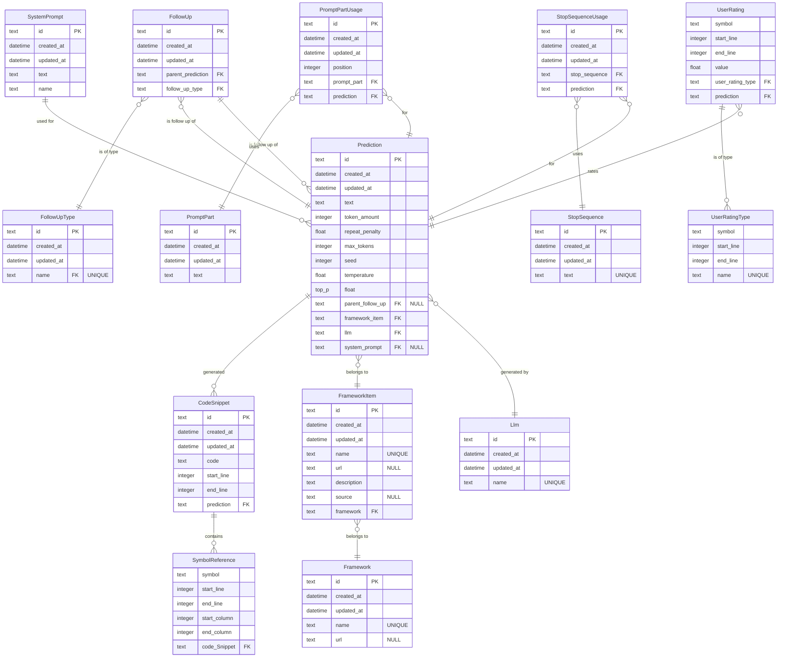

# Database Interface

## Entity Relationship Diagram of Database



## Endpoints

### `GET /`
This endpoint only exists for debugging purposes. It doesn't take any further parameters and always returns
```json
{"message": "Hello, world! This is 'db_interface'."}
```

### `GET /<table_name>/by-name/<name>`
This endpoint returns a database object from `<table_name>` with name `<name>`. Note that the object has to have a column called `name`. Possible tables names are:
1. [`follow_up_types`](#followuptype)
2. [`user_rating_types`](#userratingtype)
3. [`llms`](#llm)
4. [`frameworks`](#framework)
5. [`framework_items`](#frameworkitem)
6. [`system_prompts`](#systemprompt)

### `DELETE /<table_name>/by-name/<name>`
This endpoint deletes an existing database object from `<table_name>` with name `<name>`. Note that the object has to have a column called `name`. Possible tables names are:
1. [`follow_up_types`](#followuptype)
2. [`user_rating_types`](#userratingtype)
3. [`llms`](#llm)
4. [`frameworks`](#framework)
5. [`framework_items`](#frameworkitem)
6. [`system_prompts`](#systemprompt)

### `GET /<table_name>`
This endpoint returns a list of all database objects from `<table_name>`. Possible tables names are:
1. [`code_snippets`](#codesnippet)
2. [`follow_up_types`](#followuptype)
3. [`follow_ups`](#followup)
4. [`framework_items`](#frameworkitem)
5. [`frameworks`](#framework)
6. [`llms`](#llm)
7. [`predictions`](#prediction)
8. [`prompt_part_usages`](#promptpartusage)
9. [`prompt_parts`](#promptpart)
10. [`stop_sequence_usages`](#stopsequenceusage)
11. [`stop_sequences`](#stopsequence)
12. [`symbol_references`](#symbolreference)
13. [`system_prompts`](#systemprompt)
14. [`user_rating_types`](#userratingtype)
15. [`user_ratings`](#userrating)

### `POST /<table_name>`
This endpoint will create a new database object. You have to provide a json body with the necessary column values. Necessary columns are all columns that don't have a `NOT NULL` constraint and are not one of (`id`, `created_at`, `updated_at`). When you provide references to other database objects you have to give them as database ids.

To create a new user rating for example you would have to make a `POST` request to `http://HOST:5003/user_ratings` with a body like this:
```json
{
    "value": VALUE,
    "user_rating_type": "USER_RATING_TYPE_ID",
    "prediction": "PREDICTION_ID"
}
```

On success the response status code is `201`.

### `GET /<table_name>/<id>`
This endpoint returns a database object from `<table_name>` with id `<id>`. You can find all possible table names [here](#get-table_name).

### `PATCH /<table_name>/<id>`
This endpoint updates an existing database object from `<table_name>` with id `<id>`. You have to provide a json body (like [here](#post-table_name)) with all column values you want to update.

### `DELETE /<table_name>/<id>`
This endpoint deletes an existing database object from `<table_name>` with id `<id>`. Note that you cannot delete an object if that would violate an `ON DELETE` constraint.

### `POST /db/create`
A call to this endpoint creates all the database tables.

### `POST /db/drop`
A call to this endpoint drops all the database tables.

### `POST /db/reset`
A call to this endpoint is equivalent to subsequent call to `/db/drop` and `/db/create`.

### `POST /db/populate`
A call to this endpoint populates the database with some initial data. This is necessary for the entire system to work.
